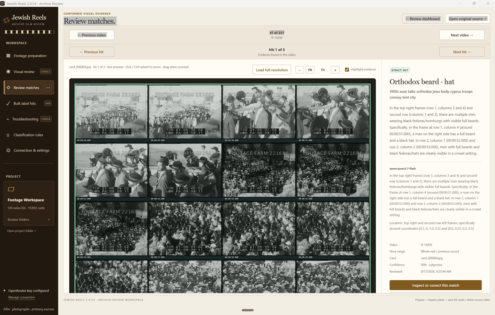
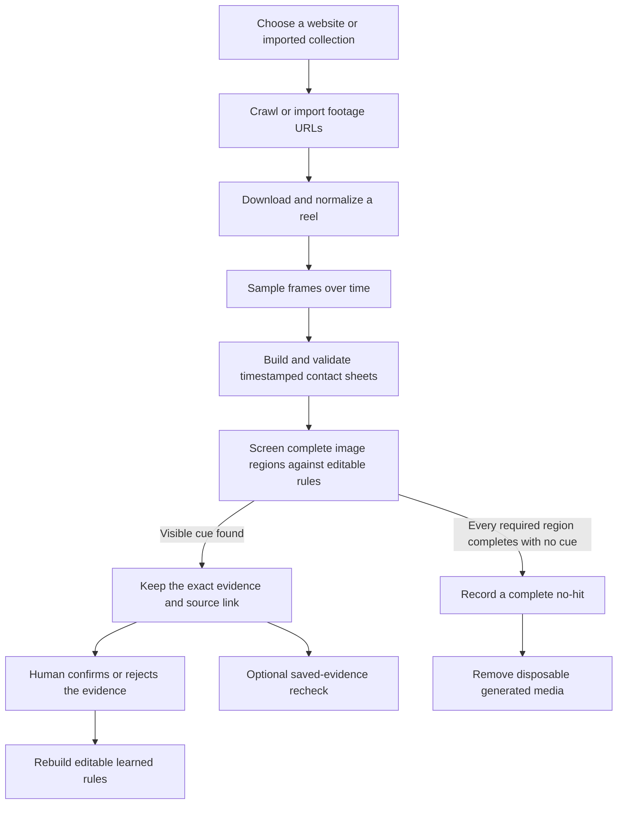
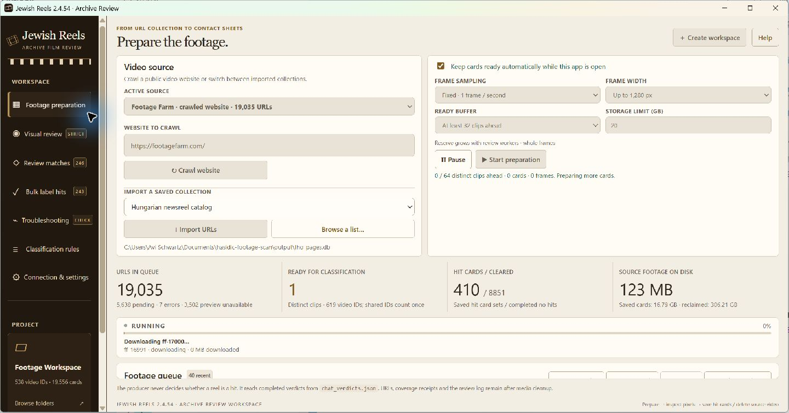
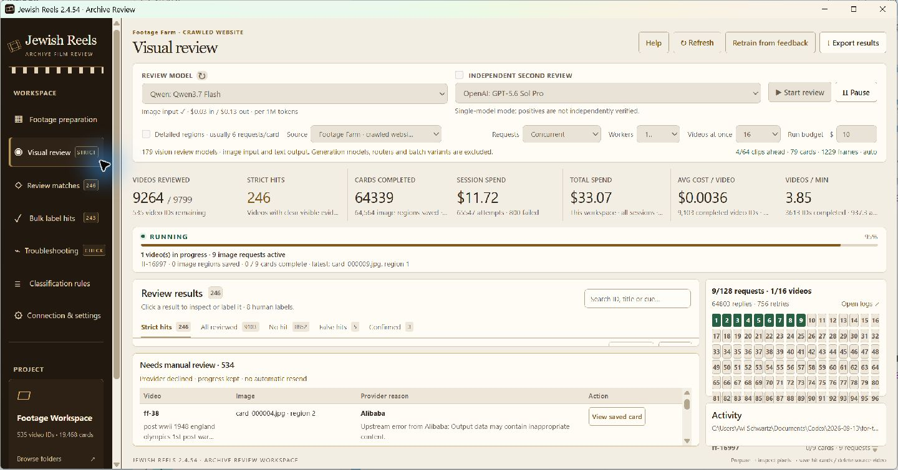
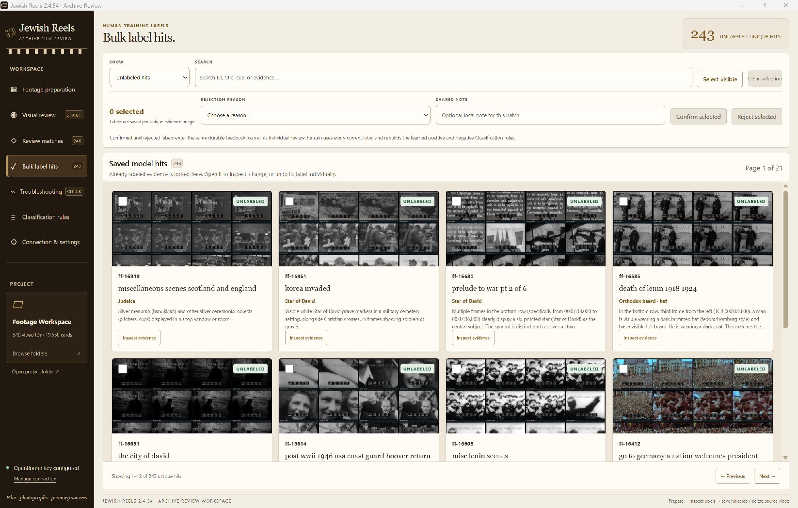
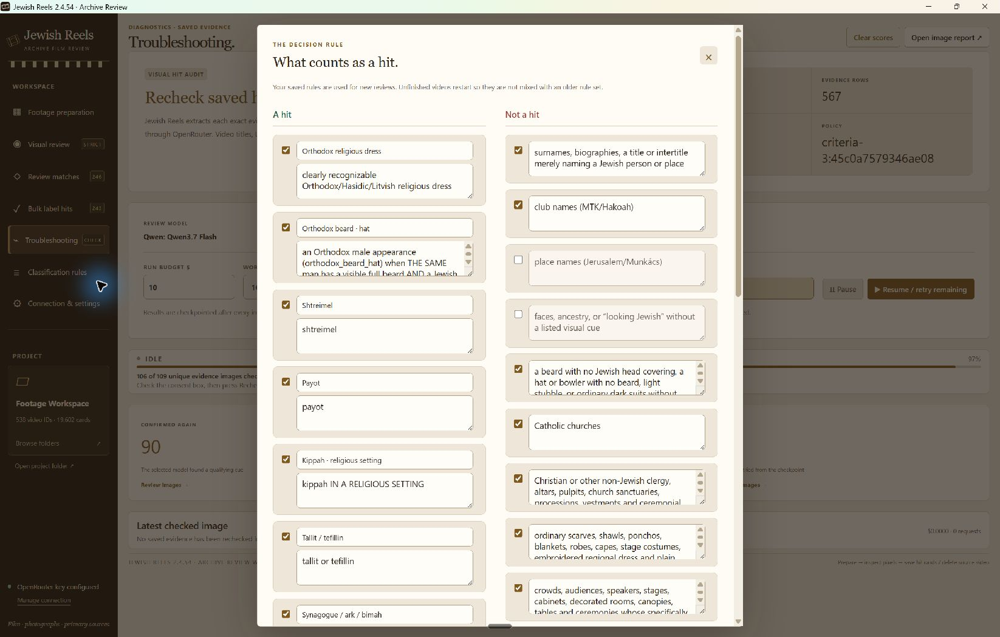
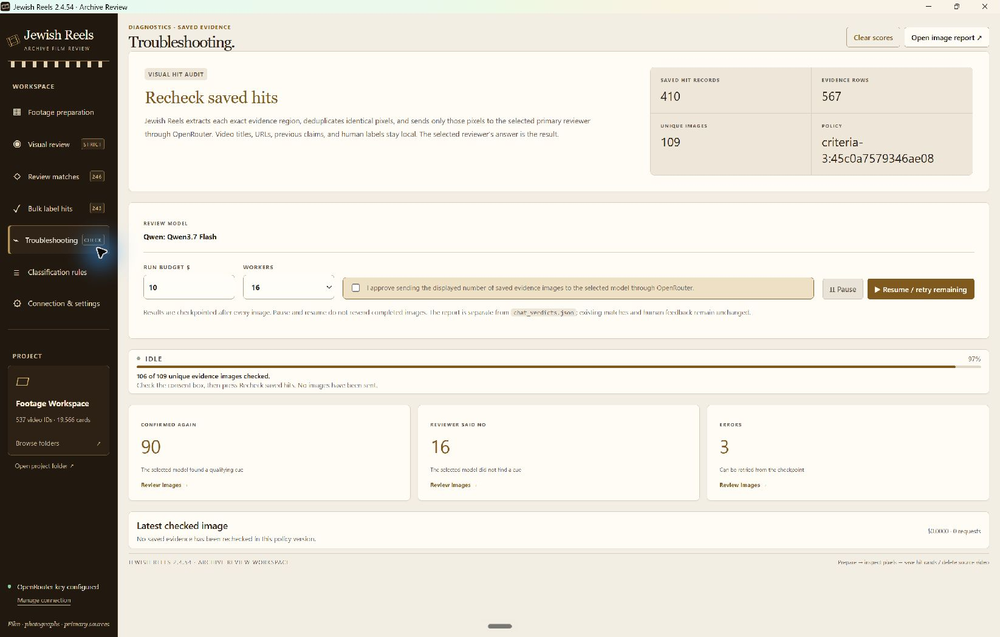

<p align="center">
  <a href="https://jewishreels.com/"></a>
</p>

<h1 align="center">Jewish Reels</h1>

<p align="center">
  Jewish Reels is a Windows desktop workspace for finding, reviewing, and organizing Jewish visual history hidden inside large collections of archival footage.
</p>

<p align="center">
  <a href="https://jewishreels.com/">JewishReels.com</a> · Version 2.4.64 · Windows 10 and 11
</p>



*A real match captured in the 2.4.54 workspace. The full contact sheet, highlighted region, selected cue, model explanation, source details, and hit-by-hit navigation remain together for human verification.*

Archival catalogs describe whole reels, but the useful evidence inside a reel may last only a few seconds. A person wearing a kippah, a tallit in a crowd, Hebrew lettering on a ship, a Star of David on a storefront, or a Jewish ritual object may never appear in the catalog title. Watching every reel from beginning to end is often impractical.

Jewish Reels turns footage into a sequence of timestamped visual records, checks those records against editable criteria, and preserves the exact image behind every candidate match. The application helps a researcher narrow a large collection to evidence worth inspecting while keeping the final judgment in human hands.

## Contents

- [What the application does](#what-the-application-does)
- [The workflow](#the-workflow)
- [1. Choose a footage source](#1-choose-a-footage-source)
- [2. Prepare complete visual coverage](#2-prepare-complete-visual-coverage)
- [3. Screen the prepared footage](#3-screen-the-prepared-footage)
- [4. Understand the result states](#4-understand-the-result-states)
- [5. Inspect every match](#5-inspect-every-match)
- [6. Confirm or reject saved hits](#6-confirm-or-reject-saved-hits)
- [7. Rebuild rules from human feedback](#7-rebuild-rules-from-human-feedback)
- [8. Recheck saved evidence](#8-recheck-saved-evidence)
- [What counts as visual evidence](#what-counts-as-visual-evidence)
- [What a saved match contains](#what-a-saved-match-contains)
- [Continuity, errors, and recovery](#continuity-errors-and-recovery)
- [Storage and cleanup](#storage-and-cleanup)
- [What stays local and what is sent](#what-stays-local-and-what-is-sent)
- [Common ways to use Jewish Reels](#common-ways-to-use-jewish-reels)
- [Run the application locally](#run-the-application-locally)
- [Workspace and repository layout](#workspace-and-repository-layout)
- [Terms used in the application](#terms-used-in-the-application)

## What the application does

Jewish Reels brings the full footage-review process into one desktop application:

- It discovers video pages on a supported website or imports an existing list of footage URLs.
- It downloads and prepares footage locally with FFmpeg, FFprobe, and yt-dlp.
- It samples the reel over time and builds timestamped contact sheets that preserve the sequence of the footage.
- It sends prepared image regions and the active visual rules to a selected vision model through OpenRouter.
- It accepts a candidate only when the model names an enabled cue, describes visible evidence, and locates that evidence in the supplied pixels.
- It keeps each candidate attached to the exact saved image, source record, explanation, and review settings that produced it.
- It lets a person confirm or reject results individually or in bulk.
- It converts reviewed examples into editable positive and negative classification rules.
- It can independently recheck all saved evidence without changing the original verdicts.
- It checkpoints completed work so preparation and review can continue after pauses, restarts, temporary provider failures, or connection loss.

The application searches for visible cues. It does not identify a person from a face, infer ancestry, or infer religion from appearance alone. Catalog titles, filenames, biographies, dates, and locations can help a researcher understand a result, but they do not count as the visual proof behind a hit.

## The workflow



Preparation and visual review are separate long-running jobs. Preparation can continue building cards while the reviewer works through cards that are already complete. This separation keeps local media work moving even when the model connection is paused, rate-limited, or unavailable.

## 1. Choose a footage source

The source selector limits preparation and each new visual-review run to one collection at a time. This makes it possible to run a clean Footage Farm job, a separate crawl of another public site, or a curated imported list without mixing their queues or deleting earlier work.

Jewish Reels can start from:

- the Footage Farm catalog crawler;
- MyFootage as an empty, isolated source before any website access;
- the generic same-site website crawler;
- a text, CSV, or JSON file containing URLs;
- a supported queue database; or
- records already imported into the current workspace.

**Add source** records the source locally and makes no request to the website. The generic crawler stays within the selected website and looks for pages containing playable video. The Footage Farm adapter understands that catalog's theme, subtheme, and reel structure.

MyFootage has an additional permission gate. Adding it creates a zero-URL source that can be selected without contacting MyFootage. Its crawl control stays locked until the operator confirms permission from the website owner; the network crawl begins only after that confirmation and a separate press of **Crawl authorized source**. The tailored crawler divides the official MyFootage catalog into the site's four exhaustive format classes so it can move beyond the site's 10,000-result ceiling and include clips that have no decade tag. Each partition receives an isolated temporary website session, every continuation page is checkpointed, and the crawler verifies the site's declared row count, rejects replayed pages, and rejects overlap between supposedly exclusive partitions. A live audit for this version accounted for all 10,007 catalog rows: 10,003 public video previews and four image-only records, which are reported but not added to the video queue. An authorized TXT, CSV, or JSON list of individual MyFootage clip URLs can also be imported into the same isolated source. Imported collections can be selected again later, and each source retains its queue, preparation state, verdicts, and retry history.

Switching the active source changes which records are eligible for preparation and new visual review. **Review matches** and **Bulk label hits** remain workspace-wide: they show saved hits from every source together and identify the source attached to each result. Switching sources does not erase or hide saved evidence from the other sources in the workspace.

## 2. Prepare complete visual coverage

Preparation converts a video into evidence that can be screened and revisited:

1. Jewish Reels resolves the playable media behind the catalog or video page.
2. The source is downloaded or normalized into local staging storage.
3. FFprobe reads its duration and timing information.
4. FFmpeg samples frames across the reel.
5. The frames are arranged into timestamped contact sheets.
6. The application verifies that the expected time range is covered.
7. The finished card set and its receipt are published together.

The default fixed mode captures one frame per second. Adaptive modes can examine two or four candidates per second and retain additional frames only when their pixels differ materially. This helps preserve a brief visual change without repeatedly storing nearly identical frames.

Contact sheets contain whole sampled frames. Large sheets can later be divided into overlapping image regions for model review so that faces, objects, clothing, and text remain large enough to inspect. A card set does not enter visual review until its coverage receipt proves that preparation finished successfully.



*The live preparation dashboard keeps the selected source, frame settings, ready buffer, storage allowance, queue totals, and current activity in one view. This workspace contains 19,035 Footage Farm URLs and keeps preparation moving while completed cards are reviewed.*

The **ready buffer** controls how much prepared work should stay ahead of the model reviewer. The working-storage limit controls managed downloads, staging files, and cards still eligible for automatic processing. Confirmed-hit evidence and manual-review holds are measured separately. Preparation can continue automatically while the application is open, or it can be paused independently of visual review.

## 3. Screen the prepared footage

Visual review reads only complete prepared card sets from the active source. The reviewer can choose:

- the active footage source;
- the primary vision model;
- an optional independent second reviewer;
- whole-card or detailed-region review;
- sequential or concurrent requests;
- a global worker ceiling;
- the number of videos allowed to share those workers; and
- a spending limit for the run.

The worker setting is a global request ceiling. It is not multiplied by the number of active videos. The simultaneous-video setting determines how many videos share that capacity. In concurrent mode, available request slots are distributed across ready videos. In take-turns mode, the application sends one image at a time and waits between responses.

Every model response is checked against a fixed output contract. A positive response must name an allowed cue, describe concrete pixels, state where the evidence appears, and return a valid normalized bounding box. A negative response must explicitly report that no qualifying cue is present. A refusal, contradiction, malformed answer, timeout, or interrupted request remains unfinished and is never silently converted into a no-hit.



*The live visual-review dashboard shows the selected model, source, concurrency, completed videos, strict hits, card coverage, session and total spend, throughput, active workers, manual-review items, and the evidence table.*

When a strict positive is found, Jewish Reels stops sending unsent regions for that video. Requests already in flight can finish and are saved. A complete negative takes longer because every required card and region must finish successfully before the application can conclude that the sampled reel contains no enabled cue.

## 4. Understand the result states

The distinction between a hit, a no-hit, and unfinished work is central to the application.

| Result | Meaning |
| --- | --- |
| **Strict hit** | At least one enabled visual cue was located in the supplied pixels, described in concrete terms, and returned with a valid location. The exact evidence is retained. |
| **No hit** | Every required contact sheet and image region completed successfully, and none contained an enabled cue. |
| **Filtered no-hit** | A local visual filter found that the prepared material could not contain the required kind of evidence under the active policy. The result remains distinguishable from an exhaustive model review. |
| **Unfinished** | Some required work remains because of a provider refusal, connection error, malformed response, changed input, missing file, interrupted request, or unsafe write. |
| **Manual review** | The application preserved the source and saved work because the provider could not complete a reliable decision automatically. |

One video can contain several distinct matches. Jewish Reels saves those matches separately so that the user can inspect every cue rather than seeing only the first positive frame.

Identical source pixels can also appear under several catalog records. The workspace can reuse the prepared media or verdict when the source fingerprint and story boundaries agree, while preserving links to every catalog record that refers to those pixels.

## 5. Inspect every match

The match-review screen combines accepted saved hits from every source in the open workspace and places the image and the claim beside each other. It includes:

- the complete saved contact sheet;
- an optional highlight around the returned location;
- the selected cue and concise summary;
- the model's evidence description and location text;
- the source video and story range;
- the card filename and source timestamps;
- the model name, confidence statement, and review time;
- a link back to the original catalog source when available; and
- controls for moving between videos and between multiple hits in one video.

The image can be fitted to the window, enlarged, and dragged while zoomed. The highlight can be turned off to inspect the unmarked source pixels. Full-resolution loading is available when the preview is not sufficient.

The screenshot at the top of this README shows a real saved match from the current workspace. The active rule selected frames containing multiple men with full beards and dark brimmed hats, and the model described the exact rows and columns where those cues appear. Jewish Reels keeps that claim beside the original timestamped contact sheet so the reviewer can confirm, correct, or reject it from visible pixels.

Confidence is the model's own estimate. It is not a measured probability of correctness. The saved pixels are the basis for accepting or correcting the result.

## 6. Confirm or reject saved hits

Human feedback can be recorded from an individual evidence view or from the bulk-label screen. Both screens browse saved hits across every source in the open workspace, while each label belongs to an exact evidence target rather than to a broad title or video category.

The bulk screen supports:

- unlabeled, confirmed, rejected, or complete views;
- search by video ID, title, cue, or evidence text;
- selection of every visible item on the current page;
- confirmation of selected evidence;
- rejection with a structured reason;
- an optional shared local note; and
- pagination through a large result set without loading every full image at once.



*The current workspace exposes real saved model hits as reviewable cards. A reviewer can inspect an item closely, select a page of clear examples, and record explicit confirmations or rejections.*

Already labeled evidence remains available for inspection. A reviewer can change or remove a label later. Bulk actions use the same durable feedback journal as individual decisions, so every resulting label stays traceable to its evidence.

## 7. Rebuild rules from human feedback

The **Retrain from feedback** action rebuilds classification rules. It does not fine-tune or change the weights of the selected model.

During a rebuild, Jewish Reels:

1. reads the complete current set of confirmed and rejected labels;
2. pairs each label with the exact evidence that was reviewed;
3. asks the selected reviewer to describe visible distinctions between intended matches and lookalikes;
4. merges lessons only when their direction and visual meaning agree;
5. replaces the previous learned entries with the newly compiled set; and
6. preserves the manually maintained rules.

There is no fixed sample limit. Similar positive lessons can become one positive rule, and similar negative lessons can become one exclusion. Positive and negative lessons are never merged together merely because their wording overlaps.

The rule editor remains the source of truth. Every rule can be enabled, disabled, or rewritten before the next review begins. Changing the policy creates a new policy fingerprint. Completed verdicts remain historical records; unfinished work continues only when its saved evidence and review configuration still match the active policy.



*Classification rules state both what qualifies and what should be rejected as a lookalike. The current editor includes religious dress, a beard with a qualifying head covering, shtreimels, payot, kippot, tallit or tefillin, synagogue features, and exclusions for metadata-only claims, appearance-based inference, Christian contexts, ordinary clothing, and generic gatherings.*

## 8. Recheck saved evidence

Troubleshooting is an independent audit of existing hits. It is useful after tightening a rule, investigating false positives, comparing a reviewer against older results, or checking whether repeated records share the same saved pixels.

Before the audit sends anything, Jewish Reels:

1. extracts the exact evidence images attached to saved hits;
2. hashes their pixels;
3. removes duplicate images;
4. reports the number of source hit records, evidence rows, and unique images; and
5. waits for the user to approve the displayed image count.

The audit uses one selected reviewer. Titles, URLs, old claims, and human labels remain local during the ordinary recheck request. Each result records the new decision, cue, explanation, image, and every video occurrence that shares those pixels.



*This live audit started with 410 saved hit records and 567 evidence rows, which became 109 unique images after pixel deduplication. Completed images are checkpointed, and errors can be retried without resending successful work.*

Troubleshooting has its own report and checkpoint. It does not alter the original verdict ledger or the human feedback journal. Clearing troubleshooting removes only the audit scores and checkpoint, allowing the same saved evidence to be evaluated again.

## What counts as visual evidence

The built-in rules focus on cues that can be resolved in the image itself. They can be edited as the research question changes.

| Cue family | Examples of qualifying evidence |
| --- | --- |
| **Religious clothing** | A distinct kippah or yarmulke, shtreimel, payot, or recognizable Orthodox or Hasidic dress. |
| **Combined dress cues** | A full beard and a qualifying dark brimmed hat on the same person, subject to the exclusions defined in the rules. |
| **Prayer objects and garments** | A tallit identified by characteristic drape, stripes, atarah, or tzitzit; tefillin identified by the visible box and strap placement. |
| **Jewish spaces** | A synagogue, ark, bimah, or Jewish cemetery supported by visible architectural or textual markers. |
| **Hebrew and Yiddish** | Recognizable Hebrew-script text in religious, educational, commercial, civic, vehicle, storefront, title-card, or other settings. |
| **Symbols and identification marks** | A resolved six-pointed Star of David, a Judenstern, or explicit Jewish identification marking. |
| **Communal markings** | Visible Jewish, kosher, Jude, Jüdisch, synagogue, Hebrew, or Zionist wording on a sign, shop, banner, building, or vehicle. |
| **Judaica and ritual** | A clearly resolved Torah scroll, menorah or hanukkiah, tefillin, or another identifiable ritual object or specifically Jewish ritual action. |

The exclusions are as important as the positive rules. Common exclusions cover biographies or surnames without a visible cue, Latin-script place names by themselves, generic crowds and ceremonies, ordinary scarves and robes, non-Jewish clergy, five- or eight-point stars, generic ornaments, Nazi imagery without an explicit Jewish cue, and details that are too ambiguous to resolve.

The application does not use a person's face as proof of Jewish identity. It does not accept phrases such as “looks Jewish.” A title that names a Jewish person or place does not create a hit unless the supplied image contains an enabled visible cue.

## What a saved match contains

A retained match is an evidence package rather than a simple yes-or-no row.

| Saved field | Why it matters |
| --- | --- |
| Video and catalog identifiers | Connect the evidence to every source record that refers to it. |
| Source title and URL | Let the researcher return to the original catalog context. |
| Story range | Distinguishes one segment of a long reel from the whole reel or another segment. |
| Card path and timestamp map | Identify the exact prepared image and the source times represented by its frames. |
| Cue | States which enabled visual rule produced the candidate. |
| Evidence summary | Describes the visible pixels that support the claim. |
| Bounding box | Locates the relevant region in normalized image coordinates. |
| Model and review configuration | Records how the candidate was produced. |
| Source fingerprint and card signature | Detect later changes to the input or prepared evidence. |
| Human label and note | Preserve the reviewer's current judgment and optional explanation. |
| Review time | Places the result in the history of a changing workspace and rule set. |

This record makes it possible to inspect a result later, compare it with a changed policy, find duplicate source pixels, or explain why the application retained a reel.

## Continuity, errors, and recovery

Long archival runs encounter rate limits, temporary connection loss, provider refusals, changed source files, and local storage pressure. Jewish Reels treats these as explicit states rather than converting them into negative results.

| Situation | Application behavior |
| --- | --- |
| Provider rate limit | New model sends wait behind a shared cooldown while responses already in flight can finish. |
| Temporary network or provider failure | The same unfinished image is retried with bounded backoff. Completed regions stay saved. |
| Provider content refusal | The item is placed on manual hold instead of being sent repeatedly or recorded as a no-hit. |
| Malformed or contradictory response | The identical image is retried under the fixed output contract. |
| Changed source or receipt mismatch | The video stays pending until preparation produces a new matching input. |
| Missing source or evidence file | The item remains unfinished and its existing work is preserved. |
| Disk or journal write failure | New paid work stops when a result might not be saved safely. |
| Cleanup failure | The media remains in place and cleanup is retried separately from the verdict. |

Completed image regions are checkpointed as they arrive. Pausing the run, closing the application, or losing the provider connection does not discard successful work. A resumed run reuses a saved region only when the policy, source fingerprint, card signature, selected model, detail mode, and other review settings still agree.

## Storage and cleanup

Downloaded source footage is temporary working material. Once complete contact sheets are published, Jewish Reels records the source identity and a signature of the exact card bytes before retiring the downloaded video. The saved source identity remains trustworthy only while the published cards continue to match that signature.

Cleanup follows the evidence state:

- A strict hit keeps the card set needed to inspect its evidence.
- A complete no-hit can remove its generated cards after the verdict, source identity, and coverage receipt agree.
- An unfinished item keeps its cards so that review can resume.
- A manual-hold item keeps its cards for deliberate inspection.
- Queue records, receipts, verdicts, feedback, and audit logs remain after disposable media is removed.

The configurable storage guard counts managed downloads, staging data, and cards still eligible for automatic processing. Confirmed-hit evidence and explicit manual-review holds do not consume that working allowance, because automatic cleanup cannot erase them. A separate real-drive free-space guard still pauses preparation before the disk becomes critically full, and hard-linked source data is counted only once.

The **Clean up media** action follows the same conservative rules as automatic cleanup. It does not delete evidence that still supports a hit, unfinished work, or a manual-review item.

## What stays local and what is sent

Jewish Reels combines local media processing with optional model requests through OpenRouter.

| Activity | Stays in the local workspace | Sent through OpenRouter |
| --- | --- | --- |
| Source discovery and preparation | URLs, catalog titles, downloads, normalized media, sampled frames, contact sheets, receipts, and queue state | Nothing |
| Ordinary visual review | Source URLs, local paths, catalog metadata, prior human labels, checkpoints, and verdict files | One prepared image region and the active visual instructions |
| Feedback rebuild | Full feedback journal, workspace metadata, and compiled rules | The selected evidence, prior visual claim, current confirmed or rejected label, and an optional note when the user includes it |
| Saved-hit troubleshooting | Source mappings, previous verdicts, old labels, duplicate mappings, and the audit checkpoint | Deduplicated saved evidence pixels and the current visual instructions |

Text visible inside a frame remains part of the image and therefore travels with those pixels. The ordinary review prompt does not use the catalog title, biography, filename, URL, or local path as evidence.

An OpenRouter key can remain in memory for the current session, come from the `OPENROUTER_API_KEY` environment variable, or be encrypted by Electron for the current Windows account. Preparation works without a model key. Visual review, feedback rebuilding, and saved-hit troubleshooting require a configured model connection.

The screenshots in this README were captured from the 2.4.54 workspace. They show real queue counts, source names, models, provider states, local paths, and archival contact sheets rather than a synthetic demonstration fixture.

## Common ways to use Jewish Reels

### Start a clean source run

1. Create or open a workspace.
2. Crawl a website or import a saved collection.
3. Select that source in **Footage preparation**.
4. Choose the sampling, frame width, ready buffer, and storage allowance.
5. Start preparation.
6. Select the same source in **Visual review** and begin screening when complete cards become available.

Other source queues remain present but do not enter the active preparation or visual-review run. Their saved hits remain available in **Review matches** and **Bulk label hits**.

### Review existing matches

Open **Review matches** to move through accepted videos from every source in the workspace. Use the hit controls to inspect every saved match in the selected video. The evidence details identify its source; you can zoom or drag the image, toggle the location highlight, load the full-resolution card, and open the original source when more context is needed.

### Correct results and improve future review

Use **Inspect or correct this match** for a single item or **Bulk label hits** for a page of workspace-wide results. Search and review hits from every source together, record confirmations and rejections, edit any earlier labels that have changed, then run **Retrain from feedback**. Review the generated learned rules alongside the manual rules before starting new work.

### Audit the current hit collection

Open **Troubleshooting**, inspect the count of unique evidence images, choose one reviewer, set a budget and worker count, approve the displayed batch, and run the recheck. Review confirmed images, reviewer-no results, and errors separately. Clear the audit when the same evidence should be scored again under a new policy.

### Resume after an interruption

Reopen the same workspace and source. Jewish Reels reads the durable preparation state, review checkpoint, completed verdicts, and deferred work. Matching completed regions are reused, and only unfinished work is scheduled again.

## Run the application locally

### Requirements

- Windows 10 or Windows 11 on x64
- Git
- Node.js 24 or newer with npm
- FFmpeg and FFprobe 9.0.1 from the Gyan essentials build
- yt-dlp 2026.08.19 for Windows
- An OpenRouter API key for model-backed review

Install the JavaScript dependencies, run the test suite, and start the Electron application:

```powershell
git clone https://github.com/JewishReels/jewish-reels-review.git
cd jewish-reels-review
npm ci
npm test
npm start
```

The media executables are expected in a sibling directory beside the repository:

```text
parent-directory/
├── jewish-reels-review/
└── package-resources/
    └── media-tools/
        ├── ffmpeg.exe
        ├── ffprobe.exe
        └── yt-dlp.exe
```

When Jewish Reels opens, choose an existing workspace or create a new one. Workspaces contain source queues, downloaded media, contact sheets, receipts, checkpoints, verdicts, feedback, and reports. Keep the workspace outside the repository.

The main development commands are:

| Command | Purpose |
| --- | --- |
| `npm start` | Start the Electron desktop application. |
| `npm test` | Run the complete Node test suite with temporary workspaces and mocked providers. |
| `npm run package` | Build a local Windows x64 application folder using the sibling media-tool bundle. |

## Workspace and repository layout

The application uses an Electron window with an isolated renderer. The visible interface cannot read arbitrary files directly. A narrow preload bridge exposes the approved operations to the main process, where workspace paths and actions are validated.

At a high level, the repository is organized as follows:

| Path | Purpose |
| --- | --- |
| `main.cjs` | Creates the desktop window, validates application actions, and coordinates the major services. |
| `preload.cjs` | Exposes the fixed set of approved operations to the interface. |
| `ui/` | Contains the preparation, visual-review, evidence, feedback, rule, and troubleshooting screens. |
| `lib/` | Contains crawling, preparation, media handling, queueing, visual review, provider communication, feedback learning, storage, and recovery logic. |
| `test/` | Exercises the review contract, checkpoint behavior, provider errors, storage rules, source isolation, learning, and interface-facing behavior. |
| `scripts/` | Contains testing, packaging, maintenance, and supporting utilities. |
| `docs/` | Stores application screenshots and supporting project documentation. |

A workspace stores the durable research state outside the source tree:

| Workspace path | Purpose |
| --- | --- |
| `.pipeline/queue.sqlite` | Sources, URLs, ownership, preparation stage, and retry state. |
| `.pipeline/media/<id>/` | Downloaded or normalized source media. |
| `.pipeline/staging/<id>/` | Preparation work that has not yet been published. |
| `.pipeline/receipts/<id>.json` | Coverage, timing, source identity, and provenance for complete preparations. |
| `frames/<id>/cards/card_*.jpg` | Published timestamped contact sheets. |
| `chat_verdicts.json` | The durable visual-verdict ledger. |
| `feedback/` | Human confirmation and rejection records. |
| `logs/` | Live checkpoints, usage records, recovery history, deferred work, and preparation events. |
| `reports/` | Exported results and saved-hit troubleshooting reports. |

## Terms used in the application

| Term | Meaning |
| --- | --- |
| **Source** | One website crawl, imported collection, queue database, or other distinct group of footage records. |
| **Prepared card** | A timestamped contact sheet made from sampled frames in one video. |
| **Image region** | A complete card or overlapping portion sent at a readable size for model review. |
| **Cue** | An enabled visual category such as a kippah, tallit, Hebrew text, or Star of David. |
| **Strict hit** | A completed positive response with an allowed cue, concrete visible evidence, and a valid location. |
| **No-hit** | A negative result committed only after all required visual coverage succeeds. |
| **Human label** | A reviewer-recorded confirmation or rejection attached to exact evidence. |
| **Learned rule** | An editable positive or negative instruction synthesized from the current human labels. |
| **Checkpoint** | Durable progress saved after completed preparation work or model responses. |
| **Manual hold** | Evidence retained for a person because an automatic decision could not be completed reliably. |
| **Policy fingerprint** | An identifier for the exact classification rules used in a run. It prevents incompatible saved work from being mixed. |
| **Source fingerprint** | An identifier for the source media or story range used to detect changed inputs and safe reuse. |

Jewish Reels is designed around one practical rule: every useful result should remain connected to the image that made it useful. The crawler finds the footage, preparation creates complete visual coverage, model review narrows the search, and the evidence viewer gives the researcher the information needed to make the final decision.
