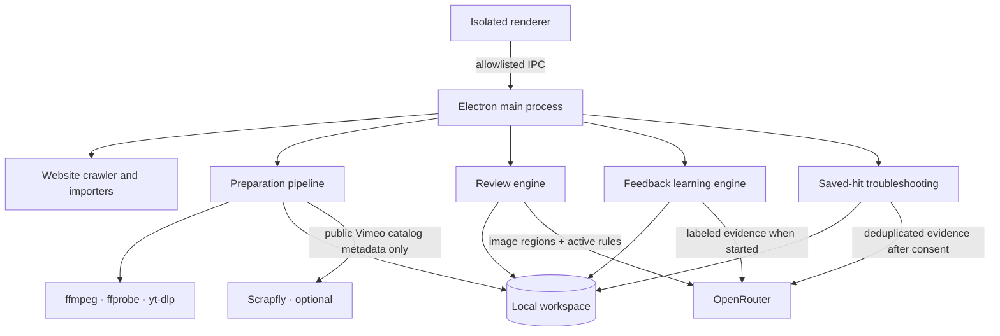

# Architecture and workspace data

For installation and operation, begin with [Getting started](getting-started.md) and the [User guide](user-guide.md). The model decision contract is documented in [Classification and evidence](classification.md), and provider/local data handling is documented in [Data and privacy](privacy.md).

Jewish Reels is an Electron desktop application with two long-running pipelines: a local footage producer and a model-backed visual reviewer. They share a workspace through durable files and a small SQLite queue, but they do not share decision-making. Preparation publishes complete image sets; review writes verdicts; cleanup acts only on completed verdicts whose source identity and coverage still match.

## Process boundaries

The renderer has no Node.js or direct filesystem access. `preload.cjs` exposes a fixed method allowlist, and `main.cjs` validates the corresponding actions. The window blocks remote navigation and uses a restrictive content security policy.

## Preparation

The producer accepts imported collections or crawler output. A website source may be registered with zero URLs, which writes only local source metadata and makes no network request. Each row belongs to a source key so the UI can operate on one source at a time. It resolves playable media, downloads to staging, probes the source, samples frames, constructs timestamped contact sheets, validates expected coverage, and then publishes the finished set.

Fixed sampling captures one frame per second. Adaptive modes may examine two or four candidates per second and retain extra frames only when their pixels differ materially. Published cards contain whole sampled frames; classification can split large contact sheets into overlapping image regions to preserve readable detail.

Preparation uses separate limits for source work and FFmpeg work. Up to twelve independent sources may resolve, download, and hash concurrently, while the extraction limit follows available processors and never exceeds four. This keeps network waits overlapped without allowing a burst of multithreaded FFmpeg processes to make the desktop unresponsive. The limits also shrink automatically for a smaller review load or working-storage allowance.

Footage Farm's ordinary page and video downloads remain direct. The optional Scrapfly adapter is a separate resolver transport restricted to the official Footage Farm Vimeo profile-search URL and numeric-video oEmbed metadata. It uses Scrapfly-managed retries, a 160-second client window, and at most two concurrent requests. Existing reel-number, official-account, duration, and unique-match checks run on the returned metadata before yt-dlp can receive a URL. A verified URL is retained across a Vimeo-authentication retry so recovery does not repeat the rate-limited search.

Prelinger and Library of Congress sources use structured public catalogs rather than the generic HTML crawler. Internet Archive enumeration uses cursor pagination and resolves playable MP4 files from item metadata. National Screening Room enumeration uses the Library of Congress JSON API and preserves every separately playable resource. If a large Library of Congress result page fails, the adapter recursively narrows that range until it can recover the available individual records instead of skipping the entire page.

The producer maintains one durable owner for identical source pixels. Exact downloaded bytes and exact story boundaries may reuse an owner's published cards; a segment inside a long reel remains distinct from the whole reel and from other story ranges. The downloaded source is hashed once while its file identity is stable. Publication then verifies the generated cards and retires the unchanged owned source without rereading the entire MP4.

## Review

The review engine discovers only complete prepared inputs. A run records the selected models, policy version, detail mode, source fingerprints, card signatures, and concurrency settings in its checkpoint. A partial checkpoint is reusable only while those inputs still agree.

Workers are a global request ceiling rather than a multiplier per video. The simultaneous-video setting controls how many videos share that capacity. In concurrent mode, available slots are distributed across ready videos. In take-turns mode, videos share one request at a time with a response gap.

A strict positive stops unsent work for that video. Already-sent requests finish and are checkpointed. A negative requires every required image region to complete successfully. Provider failures, connection loss, malformed responses, changed inputs, and file-access errors remain unfinished states.

## Human feedback and learned rules

Individual and bulk actions save `confirmed_hit` or `false_hit` labels against an exact evidence target. Labels can be edited or undone later. The feedback learning pass reads the complete current label set rather than a capped sample. It asks the selected reviewer to describe observable distinctions, merges only rules that agree in direction and visual meaning, and writes learned entries into the editable classification document.

This operation changes prompt rules, not model weights. Existing saved verdicts remain unchanged. New or unfinished reviews use the newly compiled policy snapshot.

## Saved-hit troubleshooting

Troubleshooting extracts the exact saved evidence images from accepted hits, hashes their pixels, and deduplicates identical images before sending them. It uses one selected reviewer. Titles, URLs, old claims, and labels stay local during this check. Each result stores the image, reviewer decision, explanation, cue, and every video occurrence using those pixels.

The troubleshooting report is separate from `chat_verdicts.json`. Clearing troubleshooting removes its scores and checkpoints so the same saved evidence can be evaluated again; it does not delete videos, contact sheets, verdicts, or human feedback.

## Workspace files

| Path | Purpose |
| --- | --- |
| `.pipeline/queue.sqlite` | Durable URL queue, sources, ownership, stage, and retry state. |
| `.pipeline/media/<id>/` | Downloaded or normalized source media. |
| `.pipeline/staging/<id>/` | Unpublished preparation work. |
| `.pipeline/receipts/<id>.json` | Coverage, timing, source identity, and provenance for a complete preparation. |
| `frames/<id>/cards/card_*.jpg` | Published timestamped contact sheets. |
| `chat_verdicts.json` | Durable visual verdict ledger. |
| `reelsight_manifest.json` | Optional titles, source URLs, and source-media mappings. |
| `logs/inspect_live.json` | Current review checkpoint and progress. |
| `logs/reelsight_usage.jsonl` | Recorded provider usage and cost journal. |
| `logs/reelsight_recovery.jsonl` | Review recovery actions. |
| `logs/reelsight_deferred.json` | Inputs waiting for provider or file recovery. |
| `logs/prepare_live.json` | Current preparation progress. |
| `logs/prepare_events.jsonl` | Preparation, cleanup, and retry audit. |
| `reports/` | Exported or troubleshooting reports. |

The optional manifest is presentation and deduplication metadata. Catalog titles, URLs, and biographies do not enter ordinary classification prompts.

## Failure semantics

Jewish Reels distinguishes failures by the action that can resolve them:

- **Rate limit:** all new model sends wait for a shared cooldown; in-flight responses can finish.
- **Transient connection or provider generation failure:** retry the same unfinished image with bounded backoff while preserving completed regions.
- **Public Vimeo lookup throttled:** stop the local request burst, request Scrapfly configuration, and requeue those lookups when access is saved.
- **Provider content refusal:** place the input on manual hold without repeatedly resending it.
- **Changed source or receipt mismatch:** keep the video pending until preparation creates a matching complete input.
- **Malformed model output:** retry the identical image under the output contract; never coerce a contradictory answer into a no.
- **Disk or journal integrity failure:** stop new paid work when a result might not be saved safely.
- **Cleanup failure:** retain the media and retry cleanup separately; cleanup never determines the verdict.

## Storage guard

The configured working limit covers managed downloads, staging data, and cards still eligible for automatic processing. Confirmed-hit evidence and explicit manual-review holds are measured and displayed separately, so durable evidence cannot deadlock a cleanup-only guard. The guard also maintains a minimum real-drive free-space reserve and counts NTFS hard-linked source data only once. Once complete cards are atomically published, preparation writes the source fingerprint, exact card signature, and explicit source-retirement marker to both receipts before deleting the source and staging video. Review can then trust the recorded source identity only while the published cards still match that signature. A durable hit keeps only its evidence/contact-sheet card set. A complete no-hit result with matching source identity and coverage deletes its generated cards. Cleanup waits for in-flight work to settle and preserves queue rows, receipts, verdicts, and audit logs.

Retained hit cards and manual-hold cards require deliberate review or archiving. Automatic and manual media cleanup do not erase them to make room; the independent real-drive reserve remains the final protection against exhausting the disk.

## Repository modules

- `lib/website-crawler.cjs`, `lib/footagefarm.cjs`, `lib/myfootage.cjs`, and `lib/public-archives.cjs` discover supported catalog records. MyFootage enumeration requires an explicit permission confirmation from the renderer through the main process and worker. The public-archive module implements cursor-safe Prelinger enumeration and range-recovering National Screening Room enumeration.
- `lib/queue.cjs`, `lib/pipeline.cjs`, `lib/media.cjs`, `lib/scrapfly.cjs`, and `lib/storage.cjs` own preparation and persistence.
- `lib/engine.cjs`, `lib/review-video.cjs`, `lib/openrouter.cjs`, and `lib/output-contract.cjs` own visual review.
- `lib/criteria.cjs`, `lib/feedback.cjs`, and the learning modules own editable rules and human labels.
- `lib/hit-recheck.cjs` owns the independent saved-evidence audit.
- `ui/` contains the renderer, evidence viewers, bulk review, rule editor, and troubleshooting interface.
